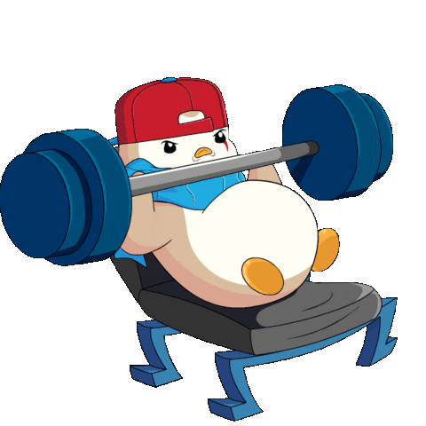

<link rel="stylesheet" href="devicon.min.css">


<!--Banner-->


<!--Header Name-->
#  
*Junior backend developer* <div align="left">
💬 <em><b> SOCIAL MEDIAS </b></em>

<a href="https://www.instagram.com/junior._lc/" target="_blank">
  
</a>
<a href="https://www.linkedin.com/in/luiz-carlos-francisco-junior-a81062274/" target="_blank">
  
</a>
<a href="mailto:lcfjunior04@gmail.com">
  
</a>

 </div>

<br /> ㅤㅤㅤ

<!--About Me-->
<em><b> ABOUT ME... </b></em>
```py
export DEFAULT function JUNIOR() {
  const PERFIL = {
    pronouns: "he" | "him",
    code: [Javascript, Typescript, Python, R, HTML, CSS],
    tools: [Node, Express, REACT Js & Native, Expo, Pandas, OpenPyXl],
    database: [SQL Server, MongoDB]

   challenge: ("Enter the programming market and make a difference");
   ps: ("More about me in my Linkedin!");
  }
}
```
#
<p align="center">
<em><b>Illustration of some skills</b></em>
</p>
<p align="center" >


</p>
<br>

<!--Projects-->
# </a>  𝐌𝐚𝐢𝐧 𝐩𝐫𝐨𝐣𝐞𝐜𝐭𝐬
[](https://github.com/llucaasbarros/boraprapraia)
[](https://github.com/LCFJunior/Automacao_Python_Excel)
[](https://github.com/LCFJunior/API-test-work)
[](https://github.com/LCFJunior/BoraPraPraia---EXPO-)

<!--Stats-->
# </a>  𝐒𝐭𝐚𝐭𝐬


<!--Certificates-->
#   𝐂𝐞𝐫𝐭𝐢𝐟𝐢𝐜𝐚𝐭𝐞𝐬
 𝐂𝐨𝐮𝐫𝐬𝐞 𝐢𝐧 𝐩𝐫𝐨𝐠𝐫𝐞𝐬𝐬 - Machine Learning with Python


 𝐆𝐫𝐚𝐝𝐮𝐚𝐭𝐢𝐨𝐧 𝐢𝐧 𝐩𝐫𝐨𝐠𝐫𝐞𝐬𝐬 - Analysis and systems development


#
<em><b><p align="center"> just a gym/technology lover... </p></b></em>
<p align="center">
 
</p>
  
<!--Footer--> 


